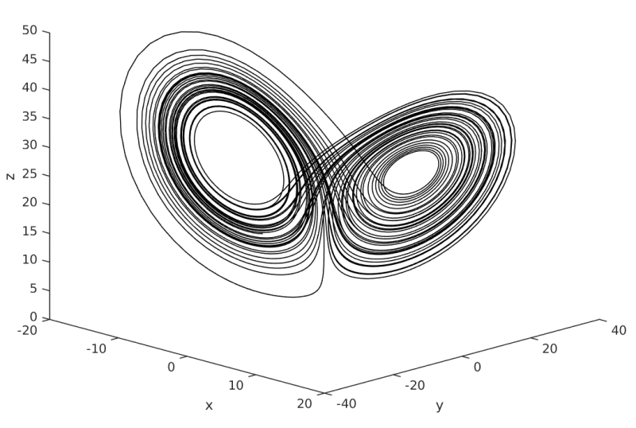
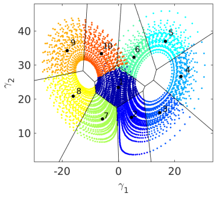
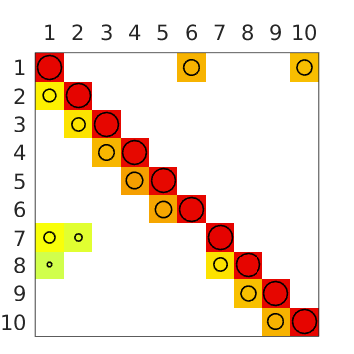

## matCROM
A Matlab library that implements the cluster-based reduced-order modeling (CROM) strategy for time series data and provides tools for its analysis. For details see  Kaiser et. al (2016)  [[JFM](http://dx.doi.org/10.1017/jfm.2014.355), [arXiv](http://arxiv.org/abs/1309.0524)].

## Example
Apply CROM to time series data of the chaotic [Lorenz system](https://en.wikipedia.org/wiki/Lorenz_system)

dx/dt = sigma (y-x)

dy/dt = x (rho-z) - y

dz/dt = x y - beta z

with sigma = 10, rho=28, and beta=8/3.

This is the phase plot of the time series data. Below the clustered Lorenz attractor and the associated transition probability matrix are displayed.


Voronoi diagram            |  Transition matrix
:-------------------------:|:-------------------------:
  |  

## Getting started

1. Run the [example](examples/example1.m).
2. Folder structure:
```
CROM
   -- src      : source files
   -- docs     : documentation
   -- examples : execution files, results in 'output'
```

3. Requirements: Matlab's Statistics and Machine Learning Toolbox for k-means algorithm
4. Add source path to Matlab's search path, e.g., using `addpath('PathToCROM/matCROM/src/')`

## License
The code is published under the [CiteMe OSS license](https://github.com/cite-me/oss). See the [LICENSE file](LICENSE) for details.

## References
E. Kaiser, B. R. Noack, L. Cordier, A. Spohn, M. Segond, M. Abel, G. Daviller, J. Östh, S. Krajnović and R. K. Niven. Cluster-based reduced-order modelling of a mixing layer. Journal of Fluid Mechanics, 754, pp. 365-414, 2014. [[JFM](http://dx.doi.org/10.1017/jfm.2014.355), [arXiv](http://arxiv.org/abs/1309.0524)]

